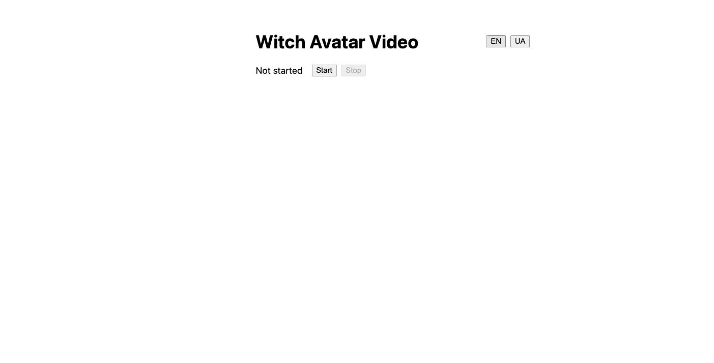
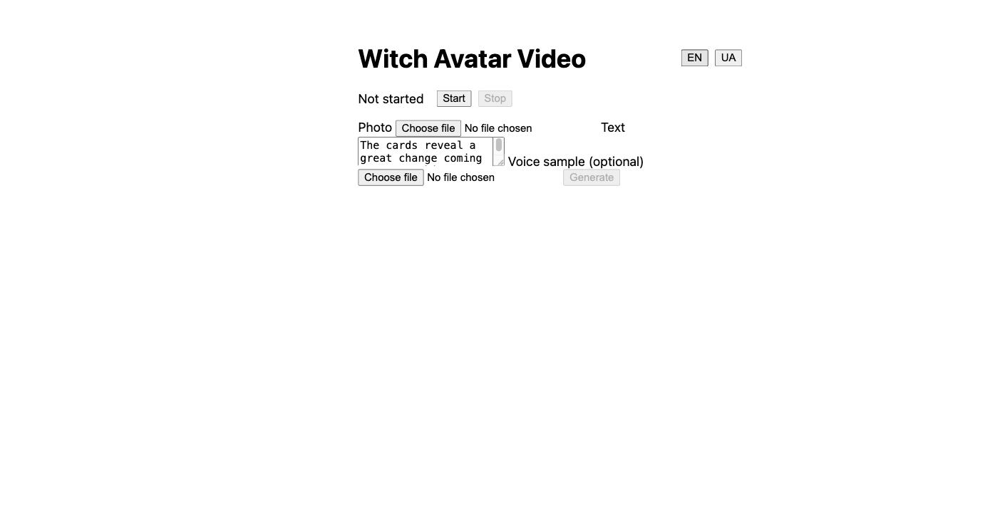

# Witch Avatar Video

*Readme also available in: [Русский](README.ru.md) | [Українська](README.uk.md)*

Generates short (5-15s) talking-head video flyers of a fictional witch/
fortune-teller ("гадалка") character for Instagram, from a reference photo
and a line of Russian-language text: local text-to-speech, then an
on-demand GPU pod renders the lip-synced video and self-terminates.

Full design rationale: [`docs/2026-08-13-witch-avatar-video-design.md`](docs/2026-08-13-witch-avatar-video-design.md).
Empirical findings/decisions log: [`docs/decisions.md`](docs/decisions.md).

## How it works

1. **Text-to-speech runs locally**, on your own machine — [Chatterbox
   Multilingual TTS](https://github.com/resemble-ai/chatterbox) turns your
   Russian text into a `.wav`, optionally cloning a voice from a short
   reference sample. No GPU pod exists yet at this point, so a bad text or
   reference clip costs nothing.
2. **A GPU pod deploys on RunPod on demand** ([EchoMimicV3-Flash](https://github.com/antgroup/echomimic_v3),
   a Wan2.1-Fun-based diffusion model), renders the photo+audio into a
   video, and the pod is **always terminated afterward** — success,
   failure, or Ctrl-C — so nothing is ever left running and billing by
   accident.
3. **Two independent ways to drive this**, both hitting the same
   underlying pod images:
   - `scripts/generate_witch_video.py` — a CLI script, run it and get a
     `.mp4` back.
   - The **WebUI** (`webui/`) — a small password-gated local web page
     (type text, upload a photo, click Generate) for non-technical use.

## Prerequisites

- **Python 3.10+** locally (developed/tested on Apple Silicon, macOS).
- **A RunPod account** with billing set up ([runpod.io](https://runpod.io)) —
  this is what actually runs the GPU render. Typical cost: **~$0.05-0.10
  per generated video** (see [Cost](#cost) below).
- **`ffmpeg`** installed locally (`brew install ffmpeg` on macOS) — used
  for TTS audio post-processing.
- **Docker**, only if you ever need to rebuild the pod images yourself
  (not needed for day-to-day use — the images are already built and
  published to GHCR by CI).

## One-time setup

### 1. Clone and install

```bash
git clone <this-repo-url>
cd Witch-Avatar-Video
python3 -m venv .venv
.venv/bin/pip install -r requirements.txt
```

**Known local-setup gotcha:** `chatterbox-tts`'s watermarking dependency
(`resemble-perth`) needs the legacy `pkg_resources` module, which modern
`setuptools` (anything ≥ ~76) no longer ships. If you see `TypeError:
'NoneType' object is not callable` coming from inside Chatterbox, run:

```bash
.venv/bin/pip install "setuptools==75.8.0"
```

(pip will print a resolver warning about `torch` wanting a newer
`setuptools` — that's just a warning, not a real conflict; torch runs
fine.) See `docs/decisions.md` / project memory for the full story if
this keeps recurring.

### 2. Get a RunPod API key and SSH keypair

1. Create an API key at [runpod.io/console/user/settings](https://www.runpod.io/console/user/settings)
   and save it to `~/.runpod-key-witch-video` (a bare text file,
   just the key, no quotes/newline issues).
2. Generate an SSH keypair RunPod pods will trust:
   ```bash
   mkdir -p ~/.runpod/ssh
   ssh-keygen -t rsa -b 4096 -f ~/.runpod/ssh/runpodctl-witch-video-ssh-key -N ""
   ```
   (`scripts/pod_up.py` reads these two paths by default — override via
   `ACCOUNT_KEY_FILE` / `SSH_PUBKEY_FILE` / `SSH_PRIVKEY_FILE` env vars
   if you keep them elsewhere.)

### 3. Set up the network volume (one-time, ~24GB of model weights)

EchoMimicV3's weights (~24GB) live on a RunPod **network volume**, not
baked into the pod image — a volume, once populated, is reused by every
future render without re-downloading anything.

1. Create a 30GB network volume via the RunPod console (Storage → Network
   Volumes), in a datacenter with real (not just globally-listed) stock
   for 40GB+ GPUs — see [Troubleshooting](#troubleshooting) for how to
   check actual per-datacenter stock before picking one, since the
   default GPU-ranking display is a global aggregate that can be
   misleading for a volume-pinned deploy. Note the volume's id. Give a
   newly-created volume a few minutes before trusting any deploy
   failures against it as "no stock" — see Troubleshooting.
2. Deploy a cheap temporary pod with that volume attached at `/workspace`
   (any small GPU is fine — this step doesn't need real compute, just
   the volume mounted):
   ```bash
   NETWORK_VOLUME_ID=<your-volume-id> MIN_VRAM=8 MAX_PRICE=0.2 \
     .venv/bin/python3 scripts/pod_up.py
   ```
3. SSH into that pod (the command prints the SSH line), upload and run
   the population script, then terminate the pod:
   ```bash
   scp -P <port> -i ~/.runpod/ssh/runpodctl-witch-video-ssh-key \
     scripts/populate_echomimicv3_volume.sh root@<ip>:/root/
   ssh -p <port> -i ~/.runpod/ssh/runpodctl-witch-video-ssh-key root@<ip> \
     "chmod +x /root/populate_echomimicv3_volume.sh && /root/populate_echomimicv3_volume.sh"
   ```
   Expect this to download ~24GB and take a few minutes. It SHA256-verifies
   every pickle-format checkpoint it downloads before finishing.
4. Terminate the temporary pod (via the RunPod console, or
   `podTerminate` through the API) — don't leave it running.
5. Set `DEFAULT_NETWORK_VOLUME_ID` in `scripts/pod_up.py` to your volume's
   id (or export `NETWORK_VOLUME_ID` every time you run a script instead
   of hardcoding it).

You only need to do this once. The images themselves (`witch-avatar-echomimicv3`
and `witch-avatar-echomimicv3-webui`) are already public on GHCR and get
rebuilt automatically by CI whenever `docker/echomimicv3*/` changes — no
manual Docker build needed for normal use.

## Usage

### CLI

```bash
.venv/bin/python3 scripts/generate_witch_video.py \
  --image assets/gadalka_portrait.jpg \
  --text "Добро пожаловать, дитя моё. Огонь свечи откроет тебе то, что скрыто во тьме." \
  --voice-sample assets/gadalka-voice-reference.wav \
  --output outputs/flyer.mp4
```

- `--voice-sample` is optional — omit it to use Chatterbox's built-in
  default voice instead of cloning one.
- `--dry-run` ranks available GPUs and prints what would happen — no TTS
  call, no deploy, no spend. Use this to sanity-check GPU pricing/stock
  before a real run.
- `--tts-only` generates just the local audio file and stops — useful for
  previewing how the text sounds before spending anything on a pod.
- `--max-price` / `--min-vram` override the GPU search (defaults: 40GB
  minimum, $0.60/hr ceiling — see [Known limitations](#known-limitations)).
- Full flag list: `--help`.

The pod is **always** terminated in a `finally` block, including on
Ctrl-C or a crash mid-render — you should never need to manually clean up
a pod after a CLI run.

### WebUI

Start the local backend (this runs on your own machine, not on RunPod —
it's what *drives* the RunPod pod on your behalf):

```bash
WEBUI_PASSWORD=<pick-a-password> \
WEBUI_BACKEND_IMAGE=ghcr.io/vasilypolyuhovich/witch-avatar-echomimicv3-webui:latest \
ACCOUNT_KEY_FILE=~/.runpod-key-witch-video \
.venv/bin/uvicorn webui.backend.app:app --port 8080
```

Then open `http://localhost:8080`, enter the password, and:

1. Click **Start** — deploys a pod (takes ~1-2 minutes to become Ready).
2. Upload a photo, type the text, optionally attach a short voice-clone
   sample.
3. Click **Generate** — the WebUI synthesizes speech locally (same
   Chatterbox step as the CLI) and forwards it to the pod for rendering.
   Expect **~9-10 minutes** for a short clip.
4. Click **Stop** when you're done — or just leave it: the pod has a
   5-minute heartbeat-timeout safety net and self-terminates if the
   WebUI stops sending heartbeats (browser closed, laptop asleep, etc.),
   so an unattended session can't run up costs indefinitely.

The page supports English and Ukrainian (switch in the header).





## Cost

- **GPU render time:** ~$0.05-0.10 per video on the cheapest available
  ≥40GB card (usually an NVIDIA A40 at $0.49/hr; a full render —
  deploy + model load + generation + download — takes ~9-10 minutes).
- **Network volume storage:** a fixed, ongoing cost independent of how
  many videos you generate — roughly $0.07/GB/month, so **~$2/month**
  for the 30GB EchoMimicV3 volume. This bills whether or not you're
  actively rendering anything; delete the volume via the RunPod console
  if you're pausing the project for a while.
- **Local TTS and the WebUI backend itself cost nothing** — they run on
  your own machine.

## Known limitations

- **Needs a ≥40GB GPU.** A real test on a 24GB card (RTX A5000) ran out
  of memory loading the model even with its own default low-VRAM mode.
  Confirmed working on 48GB (NVIDIA A40). Don't lower `MIN_VRAM` below
  40 without re-testing.
- **~5.5 second cap per single generation** (138 frames at 25fps) is
  EchoMimicV3-Flash's own documented limit for a single pass without its
  "Long Video CFG" mode, which this project hasn't wired in/verified yet.
  `scripts/run_echomimicv3.sh` and the WebUI backend both compute the
  needed frame count from your actual audio length and **cap it at 138
  frames with a loud warning** rather than silently producing something
  wrong — audio past that point gets cut off. If you need longer clips
  routinely, this needs follow-up work (see `docs/superpowers/plans/`
  for the migration plan's Task 11 notes).
- **GPU availability can be patchy in the network volume's datacenter.**
  A network volume pins every deploy to one specific RunPod datacenter
  (volumes aren't portable between datacenters), and the stock levels
  `pod_up.py --dry-run` prints are a **global** aggregate across every
  datacenter, not specific to the one your volume lives in — a GPU can
  show "Medium" stock overall while genuinely having zero capacity in
  your pinned DC. See [Troubleshooting](#troubleshooting) below for how
  to check real per-datacenter stock and what to do about it.
- **Chatterbox's Russian stress-marking (наголоси) is not enabled.** The
  underlying package (`russian_text_stresser`) is unmaintained and known
  to have installation issues on modern Python; TTS output has correct
  Russian pronunciation for unambiguous words but doesn't disambiguate
  stress-dependent word pairs. General intonation/expressiveness is
  already tuned via the `exaggeration`/`cfg_weight` parameters in
  `scripts/generate_witch_video.py`.
- **The rendered video doesn't add or animate a separate background** —
  EchoMimicV3 generates the whole frame from your source photo; whatever
  background is already in that photo is what appears (with some natural
  secondary motion near the subject — candle flicker, fabric — but not
  independent scene animation). To use a different background, edit the
  source photo before generating, not after.

## Troubleshooting

### "supply refused" for every GPU candidate

`pod_up.py`'s `--dry-run` listing shows *global* stock across all RunPod
datacenters, but a network-volume deploy is pinned to one specific
datacenter (the volume's own). The listing can show "Medium" stock for a
GPU that has genuinely zero capacity in your particular datacenter right
now. To check the real, per-datacenter number before assuming a bug:

```bash
python3 -c "
import json, urllib.request
key = open('~/.runpod-key-witch-video').read().strip()
# real per-DC stock, not the global aggregate pod_up.py's --dry-run shows
req = urllib.request.Request('https://api.runpod.io/graphql',
  data=json.dumps({'query': '''query{gpuTypes{id lowestPrice(input:{gpuCount:1,secureCloud:true,dataCenterId:\"EU-RO-1\"}){stockStatus}}}'''}).encode(),
  headers={'Authorization': f'Bearer {key}', 'Content-Type':'application/json', 'User-Agent':'x'})
print(json.load(urllib.request.urlopen(req)))
"
```
(replace `EU-RO-1` with your volume's datacenter). `stockStatus: null`
for a GPU means genuinely zero capacity there right now, regardless of
what the global listing says. This can and does happen — it's not
specific to any one datacenter. Retry after a few minutes, or raise
`--max-price` to reach a pricier card that might still have room.

### A **brand-new** network volume fails every deploy, even for cheap GPUs

Observed directly (2026-09-11): a network volume that's hours/days old
deploys normally, but a volume created moments ago can fail 100% of
deploy attempts across every GPU type and every datacenter tried,
despite those same GPU types deploying fine elsewhere. This looks like a
provisioning/propagation delay on RunPod's backend for freshly-created
volumes, not a real capacity problem — the workaround is simply to wait
(tested insufficient at 90s; try several minutes) before trusting a new
volume's deploy failures as "no stock." If you're setting up the network
volume for the first time, don't panic if the very first deploy attempt
against it fails — retry after a longer pause before concluding anything
is broken.

### Docker push to GHCR hangs or drops mid-transfer locally

If `docker push` against `ghcr.io` repeatedly fails with `broken pipe` or
`use of closed network connection` from your own machine, this is most
often local network/Docker Desktop VM instability, not a GHCR problem —
confirmed by the exact same push succeeding immediately from GitHub
Actions instead. Rather than fighting a flaky local connection, trigger
the CI build instead (it rebuilds and pushes on its own infrastructure):

```bash
gh workflow run docker-build-echomimicv3.yml --ref <your-branch>
gh workflow run docker-build-echomimicv3-webui.yml --ref <your-branch>
```

(`workflow_dispatch` requires the workflow YAML file to already exist on
the repo's **default** branch to be dispatchable at all — if you get a
"workflow not found" 404, the file needs merging there first, even if
you want to build from a different branch's Dockerfile via `--ref`.)

If CI itself fails with `permission_denied: write_package`, the repo's
Settings → Actions → General → Workflow permissions is probably set to
"Read repository contents permission" only — fix with:
```bash
gh api -X PUT repos/<owner>/<repo>/actions/permissions/workflow \
  -f default_workflow_permissions=write -F can_approve_pull_request_reviews=false
```
If it instead fails with `permission_denied: read_package` on a retry
right after that fix, the previous failed run likely left the GHCR
package in a broken half-state — delete it entirely
(`gh api -X DELETE /user/packages/container/<name>`) and let CI recreate
it cleanly on the next run. Verify any "successful" push actually
produced a real, pullable image with
`docker manifest inspect ghcr.io/<owner>/<image>:latest` — a CI run
reporting success and a package existing in GHCR's package listing have
both been observed to lie about this independently.

## Repository layout

| Path | What it is |
|---|---|
| `scripts/generate_witch_video.py` | CLI entry point |
| `scripts/pod_up.py` | RunPod GPU deploy/rank/terminate primitives, shared by both front doors |
| `scripts/run_echomimicv3.sh` | Runs on the pod for the CLI path; wraps EchoMimicV3's inference script |
| `scripts/populate_echomimicv3_volume.sh` | One-time network-volume weight download (see [setup](#3-set-up-the-network-volume-one-time-24gb-of-model-weights)) |
| `docker/echomimicv3/` | Pod image for the CLI path (SSH-only, no HTTP server) |
| `docker/echomimicv3-webui/` | Pod image for the WebUI path (small HTTP API: `/health`, `/generate`, `/status`, `/result`) |
| `docker/webui-stub/` | A throwaway fake backend (canned test clip, no real GPU inference) used to build/test the WebUI's HTTP plumbing before the real backend existed — kept for reference, not part of the real pipeline |
| `webui/backend/` | The local FastAPI server you run yourself; drives a `docker/echomimicv3-webui` pod over HTTP |
| `webui/frontend/` | The static page `webui/backend` serves |
| `tests/` | pytest suite (`./.venv/bin/python -m pytest tests/`) |
| `docs/2026-08-13-witch-avatar-video-design.md` | Original design spec |
| `docs/decisions.md` | Empirical findings log, updated as things are discovered |
